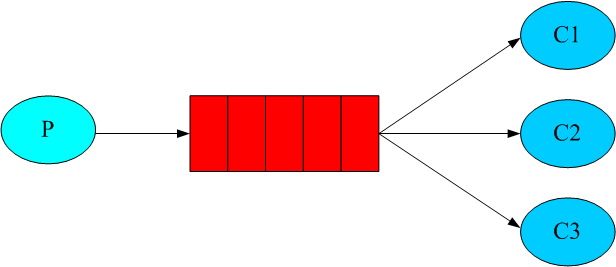

<h1 align="center">BigQueue-go tutorial</h1>

<p align="center">
This is a tutorial to show the fanout queue API usage of big queue.
</p>
Below is figure visually show the fanout semantics:<br>



## Quick  tutorial:  
**Initialize fanout queue**: <br>
You can create(initialize) a new fanout queue in just two statements: 
```go
    // new queue struct
	var fanoutqueue = new(bigqueue.FileFanoutQueue)
    // open file with target directory and queue name
	err := fanoutqueue.Open(".", "testqueue", nil)

```
Initialize with customized options
```go
    // new queue struct
	var fanoutqueue = new(bigqueue.FileFanoutQueue)
	// create customized options
	var options = &bigqueue.Options{
		DataPageSize:      bigqueue.DefaultDataPageSize,
		GcLock:            false,
		IndexItemsPerPage: bigqueue.DefaultIndexItemsPerPage,
	}

	// open file with target directory and queue name
	err := fanoutqueue.Open(".", "testqueue", options)
```
#### 参数说明:
参数名 |默认值 |  说明 
-|-|-
DataPageSize | 128 * 1024 * 1024 | Number of bytes size in one data page file |
IndexItemsPerPage | 17 |  Number of index item size in one index page file. default is 1 << 17 |

**Enqueue**: <br> 
To add or produce item into the queue, you just call the enqueue method on the queue reference, here we enqueue 10 numbers into the queue:
```go
	for i := 0; i < 10; i++ {
		content := strconv.Itoa(i)
		idx, err := fanoutqueue.Enqueue([]byte(content))
		if err != nil {
			t.Error("Enqueue failed with err:", err)
		}
	}

```

**Size**: <br>
Now there are 10 items in the queue, and it’s not empty anymore, to find out the total number of items in the queue, call the size method:
```go
	fanoutID := int64(100)
	fanoutID2 := int64(101)
	size := fanoutqueue.Size(fanoutID) // get size 10 with target fanout id
	size2 := fanoutqueue.Size(fanoutID2) // get size 10 with target fanout id2
```

**IsEmpty**: <br>
Check current queue is empty.
```go
    fanoutID := int64(100)
	isEmpty := fanoutqueue.IsEmpty(fanoutID) // return false cause fanout id(100) has 10 items

```

**Peek and Dequeue**: <br>
The peek method just let you peek item at the front of the queue without removing the item from the queue:
```go
    fanoutID := int64(100)
	index, data, err := fanoutqueue.Peek(fanoutID) 
	if err != nil {
		// print err
	}
```

To remove or consume item from the queue, just call the dequeue method, here we dequeue 1 items from the queue:
```go
    fanoutID := int64(100)
	index, data, err := fanoutqueue.Dequeue(fanoutID) 
	if err != nil {
		// print err
	}
```

**Skip**: <br>
The Skip method is to ignore the specified items count from current index.
```go
	fanoutID := int64(100)
    count := int64(10)
	err := fanoutqueue.Skip(fanoutID, count)
	if err != nil {
		// print err
	}
```


**Subscribe and FreeSbuscribe**: <br>
The Subscribe method is dequeue item from queue in asynchouse way. like listener pattern.
```go
    fanoutID := int64(100)
	fanoutqueue.Subscribe(fanoutID, func(index int64, bb []byte, err error) {
		if err != nil {
			//  we met some error
		}
		// on item dequeued with item index and item data
	})

	// free subscribe action
	fanoutqueue.FreeSubscribe(fanoutID)

	// free all subscribe action
	// fanoutqueue.FreeAllSubscribe()
```


**Close**: <br>
Finally, when you finish with the queue, just call Close method to release resource used by the queue, this is not mandatory, just a best practice, call close will release part of used memory immediately. Usually, you initialize big queue in a try block and close it in the finally block, here is the usage paradigm:
```go
	err := fanoutqueue.Close()
	if err != nil {
		// print err
	}
```


## License
BigQueue-Go is [Apache 2.0 licensed](./LICENSE).
